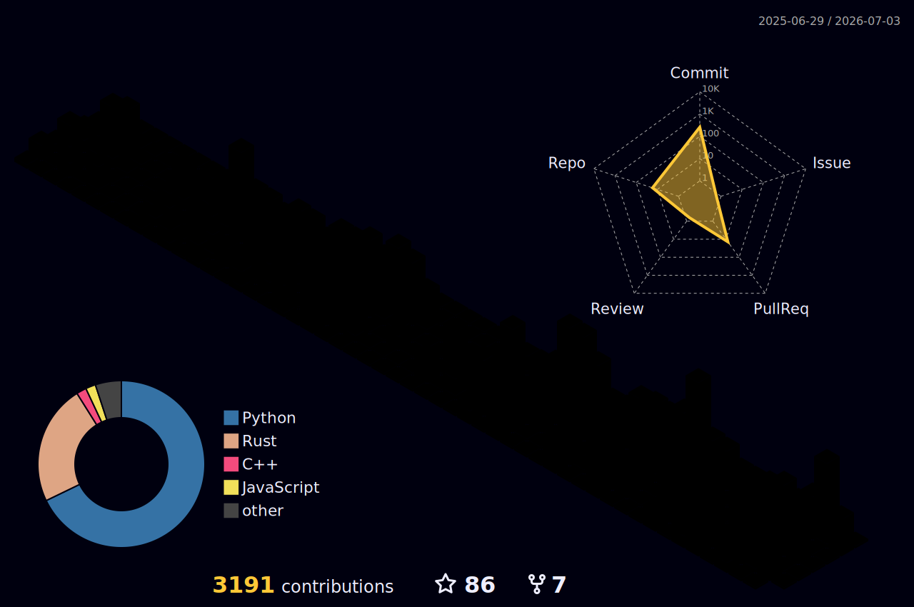

# Hi, I'm Paweł

<div align="center">
  <a href="https://www.linkedin.com/in/pawelmazurkiewicz1992/">
    
  </a>
  <a href="mailto:pawel@chillaid.art">
    
  </a>
</div>

<br/>

## About Me

Senior DevOps Engineer based in Gdańsk, Poland — currently at **Xebia Software** working for **Boston Consulting Group**. 10+ years building cloud infrastructure, automating deployments, and keeping things running at scale. Now deeply invested in the new frontiers of AI/ML technologies and their practical applications both with cloud and local providers.

```yaml
name: Paweł
role: Senior DevOps Engineer
location: Gdańsk, Poland
company: Xebia Software Sp. z o.o.
client: BCG
languages: [Polish (Native), English (C1)]
current_focus:
  - Software development
  - AI in DevOps
  - Frontier open weights models on Apple Silicon
interests: ["Music Production", "Software development", "Gaming / retrogaming"]
```

Maker of [Proxly](https://proxly.chillaid.art) — an intelligent browser chooser for macOS.

Maker of [Skillworks](https://github.com/pawel-mazurkiewicz/skillworks) - a project aware skills workspace for agents

A dude that ported [Pixal3D](https://github.com/pawel-mazurkiewicz/Pixal3D-mac) to Apple Silicon.

Come visit my [blog](https://blog.chillaid.art).



## Tech Stack

### Cloud


### Infrastructure as Code


### CI/CD


### Languages


### Monitoring


## Certifications

<div align="center">
  
  
  
  
</div>

## Experience

### **Platform Engineering** @ Xebia for Boston Consulting Group *(current)*
- Maintaining, developing and supporting Azure platform at BCG
- Building AI agents for internal use

### **Travel Platform Infrastructure** @ Xebia
- Maintaining and developing a unified platform for a major Dutch travel company
- Designing shared deployment strategies and CI/CD processes
- Leading migration from Azure DevOps/Octopus to GitHub deployments
- **Stack:** Azure, GitHub Actions, Python, PowerShell

### **Global Fintech CI/CD Migration** @ Xebia
- Migrated pipelines from EC2-based workers to Kubernetes on EKS; reduced deployment time by 60%
- **Stack:** AWS, GitLab CI, Kubernetes, EKS, Helm, Terraform

### **UK Government Shop Platform** @ Xebia
- Designed frontend deployment with SSO integration and cloud cost management
- Led Jenkins → Harness NextGen migration
- **Stack:** AWS, CloudFront, Lambda@Edge, SAM, Harness

### **Mobile Banking Infrastructure** @ HSBC
- Deployed and maintained mobile app backend for 2M+ customers
- **Stack:** AWS, GitHub, Jenkins, Docker, Terraform

### **Mobile App Backend** @ W1tty
- Automated deployments and led Kubernetes migration for improved scalability
- **Stack:** AWS, Terraform, GitLab, Docker, Kubernetes (EKS)

### **Healthcare & Government** @ Kainos
- **US Healthcare:** Microservices on AWS — Jenkins, Terraform, Ansible, SaltStack
- **UK Healthcare:** Azure lift-and-shift — Azure DevOps, DSC, Windows Server, .NET
- **StreetManager (UK Gov):** [manage-roadworks.service.gov.uk](https://www.manage-roadworks.service.gov.uk) — AWS, Terraform, CircleCI, Kubernetes

### **Infrastructure Engineer** @ Kainos *(2015–2017)*
- Sys admin across Windows/Linux/macOS; security hardening; led Mac management centralization
- **Stack:** Hyper-V, VMWare ESX, VirtualBox

## Other

- 🎵 Music: [linktr.ee/chillaidpl](https://linktr.ee/chillaidpl)
- 🎮 Retrogaming enthusiast
- 🐈‍⬛🐈 Two cats
- 📷 Amateur photography
